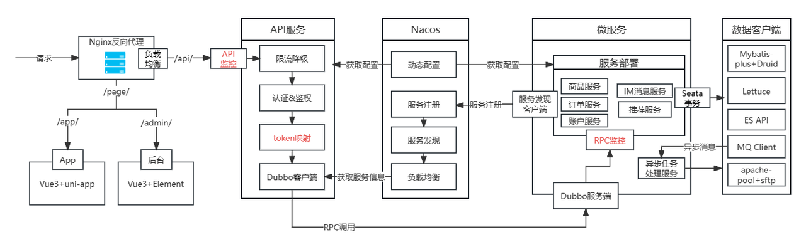
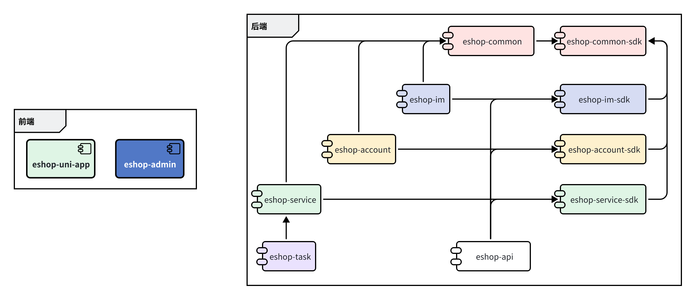
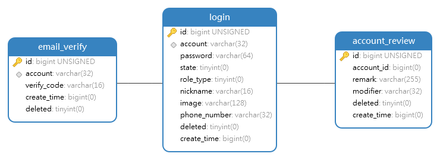
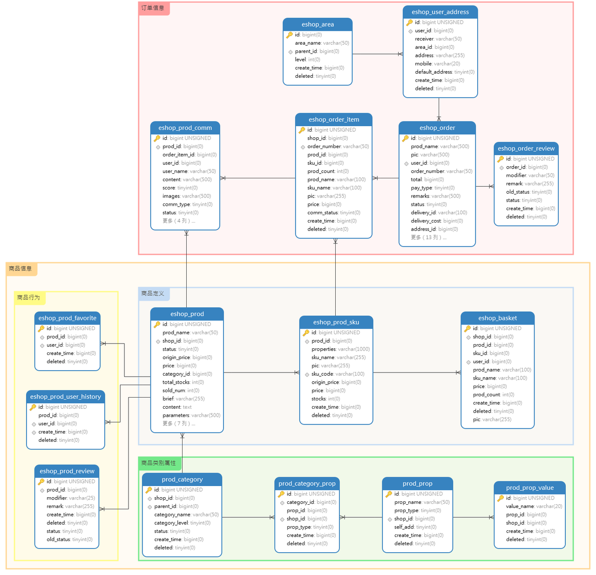

Since 2023.10.09

⭐⭐⭐⭐**团队**⭐⭐⭐⭐

- 👨‍💻Shuxin-Wang  📫shuxinwang662@gmail.com
- 👨‍💻Xinhe-Li  📫lixinhe669@gmail.com
- 👨‍💻Yibin-Shen 📫-@-
- 👨‍💻Linjie-Xu    📫xulingjie_seu@163.com
- 👨‍💻Jincheng-Li  📫1635461341@qq.com

---

> 📌

---

# 1 环境配置

## 1.1 软件安装

IDEA➕JDK`17`➕Maven`3.9.1`➕Github Desktop➕MySQL图形化工具

具体安装和环境配置网上有很多，❗版本最好保持一致❗

先把环境配好再用IDEA打开，不然IDEA内置Maven会自动配置可能会有bug❗

安装完成后用IDEA打开项目⭐

## 1.2 IDEA配置

❗前提先把上面要求的软件和环境都配置好了❗

### 1.2.1 Maven配置

文件👉设置👉构建、执行、部署👉构建工具👉Maven👉把Maven主路径改成自己下载的Maven路径👉**应用**

### 1.2.2 运行配置

在IDEA的运行配置中添加VM参数如下：

```shell
-Dnacos-addr=Nacos主机IP -Dusername=账号 -Dpassword=密码 -Dport=SpringBoot运行端口 -Ddubbo-port=Dubbo服务端端口 -Dqos-port=Dubbo客户端端口
```


## 1.3 线上部署

### 1.3.1 服务运行

```shell
java -jar -Dnacos-addr=Nacos主机IP -Dusername=账号 -Dpassword=密码 -Dport=SpringBoot运行端口 -Ddubbo-port=Dubbo服务端端口 -Dqos-port=Dubbo客户端端口 -DDUBBO_IP_TO_REGISTRY=Dubbo服务注册IP
```


# 2 系统设计

## 2.1 结构设计




## 2.3 项目模块



# 3 数据库设计

## 3.1 账号模块



## 3.2 服务模块


